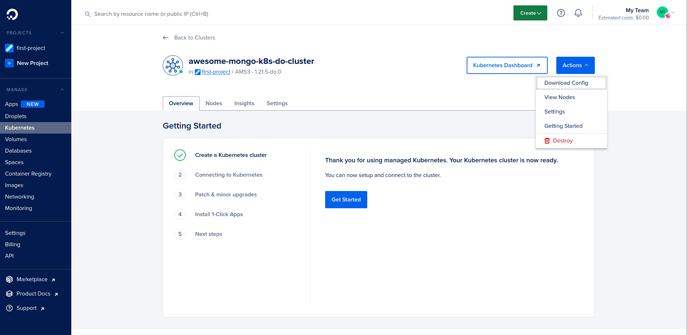
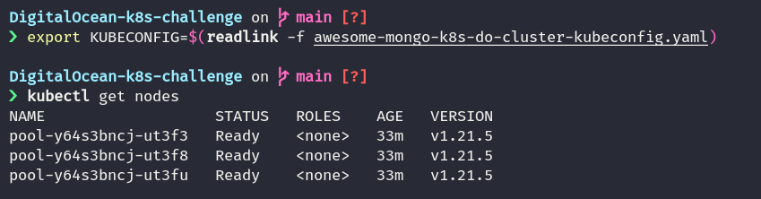
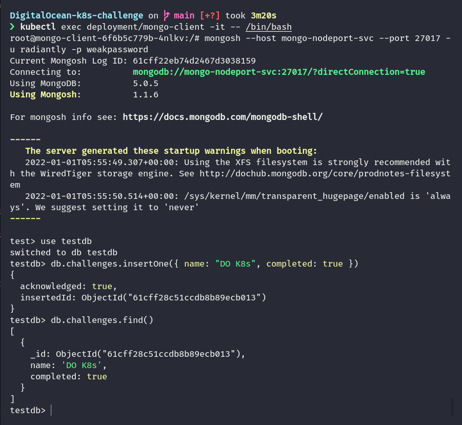

# DigitalOcean's K8s challenge: Deploy a NoSql Database cluster

Find the challenge details [here](https://www.digitalocean.com/community/pages/kubernetes-challenge)!

## Writeup

The first thing to do is to visit the DigitalOcean dashboard and create a managed k8s cluster.



Once the cluster has been created, the kubeconfig file can be downloaded and used to access the cluster.

```sh
# Specify downloaded kubeconfig file
export KUBECONFIG=$(readlink -f awesome-mongo-k8s-do-cluster-kubeconfig.yaml)

# Test if working
kubectl get nodes
```



For this project, I've selected MongoDB to deploy as I've worked with it on various other projects.

Firstly, we'll create a secret to hold the mongodb username and password

```yaml
# mongodb-secrets.yml
apiVersion: v1
data:
  username: cmFkaWFudGx5
  password: d2Vha3Bhc3N3b3Jk
kind: Secret
metadata:
  creationTimestamp: null
  name: mongo-creds
```

Next, we create a persistent volume and associated claim.

```yaml
# mongodb-pv.yml
apiVersion: v1
kind: PersistentVolume
metadata:
  name: mongo-data-pv
spec:
  accessModes:
    - ReadWriteOnce
  capacity:
    storage: 1Gi
  hostPath:
    path: /data/mongo
```

```yaml
# mongodb-pvc.yml
apiVersion: v1
kind: PersistentVolumeClaim
metadata:
  name: mongo-data
spec:
  accessModes:
    - ReadWriteOnce
  resources:
    requests:
      storage: 1Gi
```

Now, to create the MongoDB deployment:

```yaml
# mongodb-deployment.yml
apiVersion: apps/v1
kind: Deployment
metadata:
  labels:
    app: mongo
  name: mongo
spec:
  replicas: 1
  selector:
    matchLabels:
      app: mongo
  strategy: {}
  template:
    metadata:
      labels:
        app: mongo
    spec:
      containers:
        - image: mongo
          name: mongo
          args: ["--dbpath", "/data/db"]
          livenessProbe:
            exec:
              command:
                - mongo
                - --disableImplicitSessions
                - --eval
                - "db.adminCommand('ping')"
            initialDelaySeconds: 30
            periodSeconds: 10
            timeoutSeconds: 5
            successThreshold: 1
            failureThreshold: 6
          readinessProbe:
            exec:
              command:
                - mongo
                - --disableImplicitSessions
                - --eval
                - "db.adminCommand('ping')"
            initialDelaySeconds: 30
            periodSeconds: 10
            timeoutSeconds: 5
            successThreshold: 1
            failureThreshold: 6
          env:
            - name: MONGO_INITDB_ROOT_USERNAME
              valueFrom:
                secretKeyRef:
                  name: mongo-creds
                  key: username
            - name: MONGO_INITDB_ROOT_PASSWORD
              valueFrom:
                secretKeyRef:
                  name: mongo-creds
                  key: password
          volumeMounts:
            - name: "mongo-data-dir"
              mountPath: "/data/db"
      volumes:
        - name: "mongo-data-dir"
          persistentVolumeClaim:
            claimName: "mongo-data"
```

To access the instance, a mongo client is also create:

```yaml
# mongodb-client.yml
apiVersion: apps/v1
kind: Deployment
metadata:
  creationTimestamp: null
  labels:
    app: mongo-client
  name: mongo-client
spec:
  replicas: 1
  selector:
    matchLabels:
      app: mongo-client
  strategy: {}
  template:
    metadata:
      creationTimestamp: null
      labels:
        app: mongo-client
    spec:
      containers:
        - image: mongo
          name: mongo-client
          env:
            - name: mongo-client_INITDB_ROOT_USERNAME
              value: "dummy"
            - name: mongo-client_INITDB_ROOT_PASSWORD
              value: "dummy"
```

Finally, all the configurations can be applied:

```sh
kubectl apply -f .
```

To test our deployment, we can exec into the mongo client container and connect to the mongodb instance:

```sh
kubectl exec deployment/mongo-client -it -- /bin/bash

mongosh --host mongo-nodeport-svc --port 27017 -u radiantly -p weakpassword
```



## License

MIT
